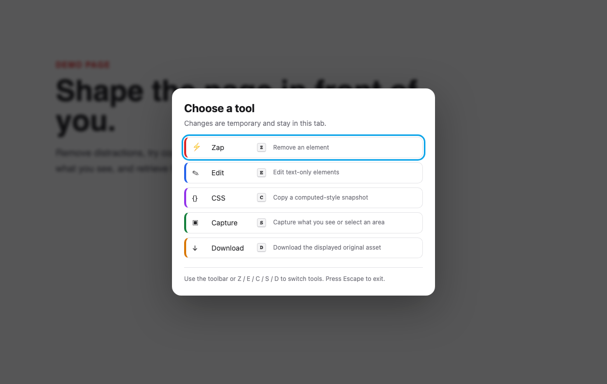
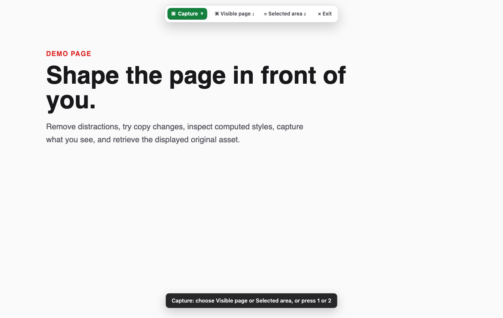

# PageWand

**A lightweight browser toolkit for shaping any webpage.**

PageWand (PW) is a lightweight Chrome extension for temporarily cleaning up and inspecting a webpage. Remove distracting elements, edit text-only content, copy a computed CSS snapshot, capture and annotate what you see, or download the displayed original asset.



PageWand has no runtime dependencies, backend, accounts, analytics, or telemetry. It runs on demand in the active tab.

## What it does

| Tool | Shortcut | Action |
| --- | --- | --- |
| Zap | `Z` | Remove the element under the pointer. |
| Edit | `E` | Temporarily edit a text-only element. `Esc` cancels; `Ctrl/⌘ + Enter` saves. |
| CSS | `C` | Preview and copy a selected computed-style snapshot. |
| Capture | `S` | Capture the visible part of the page (`1`) or a selected area (`2`), then annotate it. |
| Download | `D` | Download the displayed original image, SVG, icon, or background image. |

The compact toolbar shows only the current tool and actions that apply to it. Choose the current tool to switch tools; Capture reveals **Visible page** and **Selected area**, Parent appears only for element-based tools, and Undo appears only when there is something to restore. Keyboard shortcuts are ignored while you type in an input, textarea, select, or editable region.



## Install from source

1. Download or clone this repository.
2. Open `chrome://extensions` in Chrome.
3. Enable **Developer mode**.
4. Select **Load unpacked**.
5. Choose this repository folder, or the extracted contents of a release archive.
6. Pin **PageWand** if you want it visible in the toolbar.

Click the extension icon—or press `Alt + Shift + Z`—in a normal webpage tab to start or stop a session. Chrome does not permit extensions to inject scripts into internal pages such as `chrome://` URLs or the Chrome Web Store.

## How changes behave

- Page changes are temporary DOM changes in the current tab. Reloading the page normally restores the website.
- Zap and saved text edits share a 50-step, session-only undo stack.
- Edit mode intentionally accepts text-only elements. This preserves page-owned child elements and event handlers; select a nested text element instead of editing a container with child markup.
- Parent targeting lets you move from the hovered element to its containing element without risking removal of `html` or `body`.
- CSS output is a selected computed-style snapshot. It is not the page's source stylesheet and does not include pseudo-elements, inactive states, unmatched media rules, or authored variable names.
- **Visible page** captures only the part of the webpage currently on screen; it does not create a stitched image of the entire page.
- **Pixelate is a visual effect, not secure redaction.** Use the opaque Redact tool when covering sensitive content.
- Download preserves the displayed original asset and its known extension. It does not silently flatten animated images into PNG.

## Current scope and limitations

PageWand targets the main document of ordinary HTTP and HTTPS pages that Chrome allows the extension to access. It does not traverse iframes or closed/open Shadow DOM internals. Some sites may block clipboard operations or asset downloads, and Chrome-protected pages cannot be modified. Responsive assets use an image's displayed `currentSrc` when available.

## Privacy and permissions

See [PRIVACY.md](PRIVACY.md) for the complete plain-language explanation.

| Permission | Why it is needed |
| --- | --- |
| `activeTab` | Grants temporary access only after you click the extension on the current tab. |
| `scripting` | Injects and removes the extension's local scripts and styles on that tab. |
| `clipboardWrite` | Copies computed CSS and annotated screenshots when you request it. |
| `downloads` | Saves the original asset you explicitly select. |

There are no declared persistent host permissions and no web-accessible resources.

## Development

Requires Node.js 20 or newer for development checks. Runtime extension code remains dependency-free.

```bash
npm install
npm run check
npm run test:extension
```

`npm run check` performs JavaScript syntax checks, runs browser and service-worker regressions, builds an allowlisted release ZIP, and verifies that the archive contains no local planning files, editor settings, dependency folders, or Git metadata. `npm run test:extension` separately loads the actual runtime in an unpacked extension's isolated world, using a disposable Chromium profile, and verifies clean UI teardown.

To build only the extension archive:

```bash
npm run package
```

The result is written to `dist/pagewand-<version>.zip`.

## Contributing and security

See [CONTRIBUTING.md](CONTRIBUTING.md) before opening a pull request. Please use the private reporting route in [SECURITY.md](SECURITY.md) for vulnerabilities and avoid public issues containing exploit details.

## License

[MIT](LICENSE)
